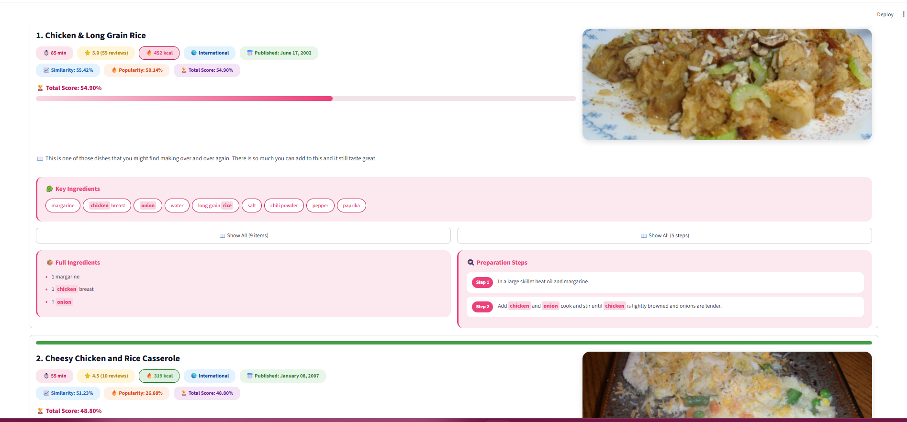
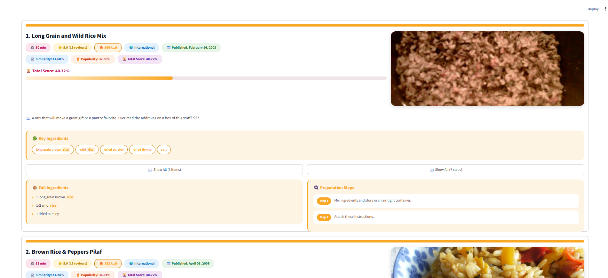

#  Smart Recipe Search Engine

An intelligent recipe retrieval and recommendation system based on Information Retrieval techniques.

This project allows users to search recipes using ingredients and retrieve the most relevant recipes using **TF-IDF**, **Cosine Similarity**, and **Popularity Ranking**.

The system provides an interactive Streamlit interface with recipe details, images, calorie filtering, ranking scores, and ingredient-based search.


#  Features

-  Search recipes by ingredients
-  TF-IDF based information retrieval
-  Cosine Similarity ranking
-  Popularity-based recommendation
-  Detailed recipe information
-  Local recipe image support
-  Calorie range filtering
-  Rating and review analysis
-  Cuisine information
-  Interactive Streamlit user interface


#  Technologies

- Python
- Streamlit
- Pandas
- NumPy
- PyArrow
- Requests
- Information Retrieval Algorithms
- TF-IDF
- Cosine Similarity


#  Project Structure

```
Recipe_Search_Engine/

│
├── app.py
│       Streamlit user interface
│
├── build_dataset.py
│       Dataset cleaning and preprocessing pipeline
│
├── download_images.py
│       Downloads recipe images locally
│
├── search_engine.py
│       TF-IDF indexing and ranking engine
│
├── requirements.txt
│
├── README.md
│
├── data/
│   ├── recipes_clean.json
│   └── recipes_images.json
│
├── cache/
│   └── vocabulary.json
│
├── screenshots/
│
└── docs/
    └── architecture.md

```


#  System Architecture

The complete pipeline of the project:

```
Raw Dataset
      |
      v
build_dataset.py
      |
      v
recipes_clean.json
      |
      v
download_images.py
      |
      v
recipes_images.json
      |
      v
search_engine.py
      |
      v
TF-IDF Search Index
      |
      v
app.py
      |
      v
Streamlit Application
```


#  Installation


Clone the repository:

```bash
git clone repository_url
```


Move into project directory:

```bash
cd Recipe_Search_Engine
```


Install required packages:

```bash
pip install -r requirements.txt
```


#  Running The Project


## Option 1: Run Existing Version

If the processed dataset already exists:

```
data/recipes_images.json
```

Simply run:

```bash
streamlit run app.py
```


The application will automatically create the search index if needed.


#  Running The Complete Pipeline From Scratch


If you want to rebuild the project completely:


## Step 1 - Build Clean Dataset

Run:

```bash
python build_dataset.py
```


This process:

- Reads the original dataset
- Cleans invalid recipes
- Extracts ingredients
- Processes instructions
- Creates the cleaned dataset


Output:

```
data/recipes_clean.json
```


## Step 2 - Download Recipe Images

Run:

```bash
python download_images.py
```


This step downloads recipe images and creates:

```
data/images/
```


and:

```
data/recipes_images.json
```


 Important:

The image folder is not included in the repository because it contains thousands of image files.

To display recipe images, every user must run:

```bash
python download_images.py
```

before running the application.


## Step 3 - Run Application

Start Streamlit:

```bash
streamlit run app.py
```


#  Search Algorithm


The ranking system combines three main concepts:


## TF-IDF

Recipe documents are converted into numerical vectors using:

- Recipe title
- Ingredients
- Instructions
- Keywords


## Cosine Similarity

Measures similarity between the user's query and recipes.


## Popularity Score

Uses:

- Recipe rating
- Number of reviews


Final ranking formula:


```
Final Score = 0.9 * Similarity + 0.1 * Popularity
```


#  Dataset Files


## recipes_clean.json

Contains cleaned recipe information:

- Recipe title
- Ingredients
- Instructions
- Ratings
- Calories
- Metadata


## recipes_images.json

Contains final processed recipes with local image filenames.

This file is used by the search engine.


#  Cache Files


The cache folder contains:


## vocabulary.json

Contains the generated vocabulary from the TF-IDF model.

This file is lightweight and included in the repository.


## index.pkl

Contains the generated TF-IDF search index.

It is automatically created when the application runs for the first time.


The file is intentionally excluded from GitHub because:

- It is a generated cache file
- It can be recreated automatically
- It increases repository size


#  Screenshots


## Home Page


## Search Results




## Calorie Filtering




## Architecture


# Documentation


Technical documentation is available in:

```
docs/architecture.md
```


#  Notes

- Original raw datasets are not included because of their large size.
- Recipe images are downloaded locally using `download_images.py`.
- The search index is generated automatically.
- The project can run without images, but recipe images require the image download step.
- `index.pkl` is a generated cache file and should not be uploaded to GitHub.


#  Author

Sheyda Fathi